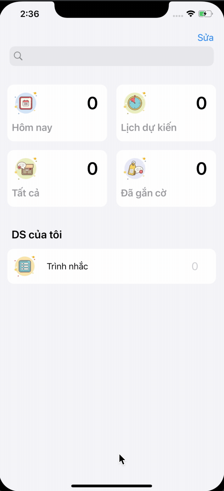

#  Demo iOS Reminder

## Sao chép lại màn hình iOS Reminder
Một số tính năng:
- Chuyển qua lại giữa màn hình chính là màn hình Reminder.
- Dựng lại thiết kế của iOS Reminder.
## UIKit được sử dụng:
- UIView
- UILabel
- UINavigationController
- UIBarButtonItem
- UICollectionView
- ...

